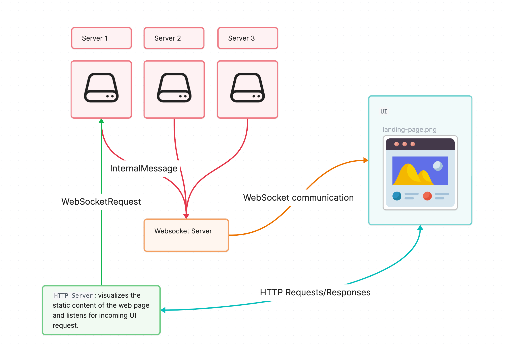

# Introduction
This is the server implementation for the Advanced Programming Course 2024-2025 at the University of Trento.\
This repository provides the implementation for the Communication server.

# Overview
The server implementation is organized in 2 main feature blocks:

- Standard: basic features of Packet Handling and Network Discovery
- Custom: more advanced custom features that include:
    - Load balancer: server requests are split among multiple worker threads
    - Persistency: client messages are saved in a DB
    - UI: user interface for interacting with the server and seeing statistics

## Load balancer

## Persistency

## UI
The UI is implemented through the combination of:

- **WebSocket Controller**: used for full-duplex communication between the `(n+1)` WebSocket Clients and the WebSocket Server. There are `n` WebSocket Clients which are associated to the servers of the network and one WebSocket Client that hosts the static page.
- **HTTP Server**: allows the hosting of a landing page with the UI.

This is a simple diagram explaining the overall architecture:
